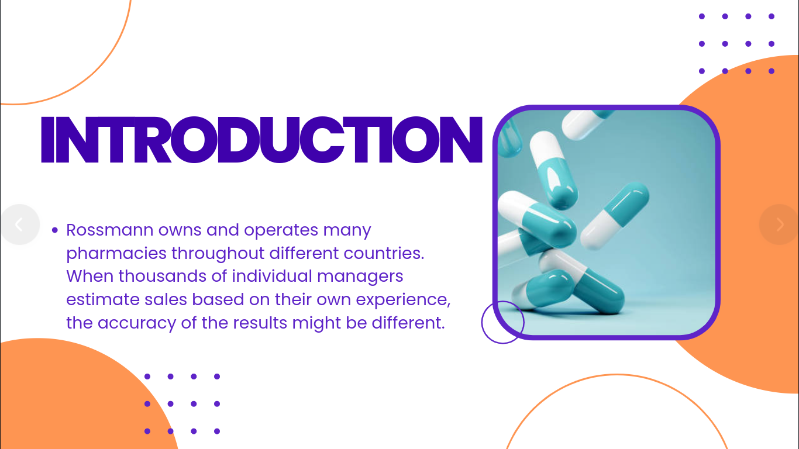
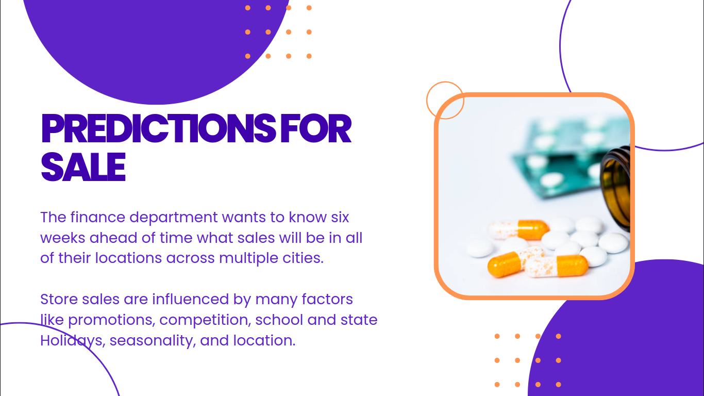

<h1 align="center">Rossmann Pharmaceutical Sales Prediction</h1>
<div>
<a href="https://github.com/Abel-Blue/pharmaceutical-sales-prediction/network/members"></a>
<a href="https://github.com/Abel-Blue/pharmaceutical-sales-prediction/pulls"></a>
<a href="https://github.com/Abel-Blue/pharmaceutical-sales-prediction/issues"></a>
<a href="https://github.com/Abel-Blue/pharmaceutical-sales-prediction/graphs/contributors"></a>
<a href="https://github.com/Abel-Blue/pharmaceutical-sales-prediction/blob/main/LICENSE"></a>
</div>

</br>


## Data visualization link
- [visualization link](https://share.streamlit.io/abel-blue/pharmaceutical-sales-prediction/main/app.py)

## Articles
- [Medium Article](https://medium.com/@Abel-Blue/pharmaceutical-sales-prediction-using-a-deep-learning-model-92d7d1e9626b)

## Table of Contents

* [Rossmann-Pharmaceuticals-Sales-Prediction](#pharmaceutical-sales-prediction)

  - [Introduction](##Introduction)
  - [Project Structure](#project-structure)
    * [data](#data)
    * [models](#models)
    * [notebooks](#notebooks)
    * [scripts](#scripts)
    * [sql](#sql)
    * [tests](#tests)
    * [logs](#logs)
    * [root folder](#root-folder)
  - [Installation guide](#installation-guide)

## Introduction




## Project Structure

### images:

- `images/` the folder where all snapshot for the project are stored.

### logs:

- `logs/` the folder where script logs are stored.

### mlruns:
- `mlruns/0/` the folder that contain auto generated mlflow runs.
### data:

 - `train_store.csv.dvc` the folder where the dataset versioned csv files are stored.

### .dvc:
- `.dvc/`: the folder where dvc is configured for data version control.

### .github:

- `.github/`: the folder where github actions and CML workflow is integrated.

### .vscode:

- `.vscode/`: the folder where local path fix are stored.
### modles:
- `28-05-2022-00-05-32-52.91%.pkl`: the folder where model pickle files are stored.

### notebooks:

- `data_preProcessing.ipynb`: a jupyter notebook for preprocessing the data.
- `data_exploration.ipynb`: a jupyter notebook for exploring the data.
- `ml_preProcess`: a jupyter notebook for preprocessing the data for ml analysis.
- `ml_model`: a jupyter notebook training an Regression models for prediction purpose.
- `time_series_ltsm.ipynb`: a jupyter notebook training an LSTM model for forecasting purpose.

###  scripts:

- `applications/`: folder where dashboard design are stored.
- `web-css/`: folder where style sheet are stored
      - `index.html`
      - `styles.css`
- `data_cleaner.py`: a python script for cleaning pandas dataframes.
- `data_preProcessing.py`:  a python script for accessing information data from a pandas dataframe.
- `ltsm_model`: a python script for model manipulation.
- `data_manipulator.py`: a python script for manipulating dataframes.
- `data_exploration.py`: a python script for plotting dataframes.
- `multiapp.py`: a python script for creating a multipaged streamlit app.
- `log_help.py`: a python script that creates python based logger.
### tests:

- `tests/`: the folder containing unit tests for the scripts.

### sql:

- `sql/`: the folder containing database table and mysql-python manipulator script.
### root folder

- `train.py`: holds cml report and model metrics.
- `results.txt`: contains cml pr reports.
- `requirements.txt`: a text file lsiting the projet's dependancies.
- `.travis.yml`: a configuration file for Travis CI for unit test.
- `app.py`: main file for the streamlit application.
- `setup.py`: a configuration file for installing the scripts as a package.
- `README.md`: Markdown text with a brief explanation of the project and the repository structure.
- `Dockerfile`: build users can create an automated build that executes several command-line instructions in a container.

## Installation guide

```bash
git clone https://github.com/Abel-Blue/pharmaceutical-sales-prediction.git
cd pharmaceutical-sales-prediction
sudo python3 setup.py install
```
